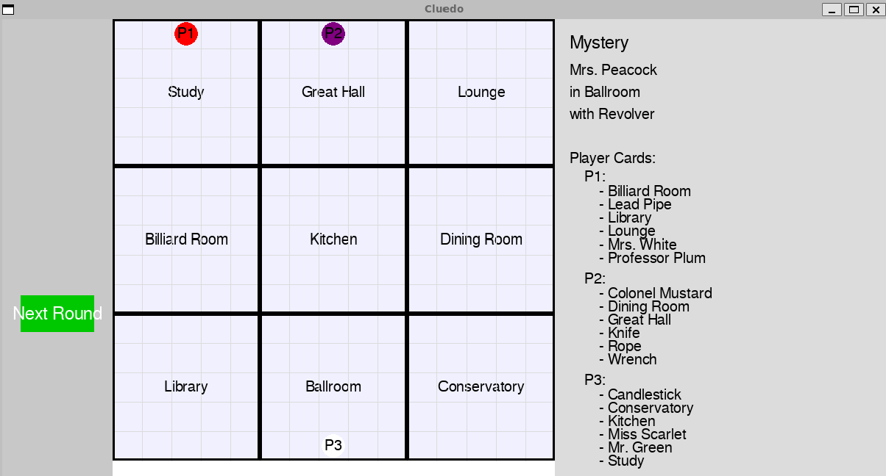

# Cluedo AI Game

An automated, AI-driven version of the classic Cluedo board game built with Python and Pygame.

The project simulates a complete game of Cluedo using autonomous player agents that move around a virtual mansion, make accusations, learn from other players, update their knowledge, and continue playing until one agent correctly solves the mystery.

## Game Interface



The Pygame interface visualizes the mansion game board, player positions, mystery information, and round-by-round activity as the autonomous agents attempt to solve the murder.

## Project Overview

This project was developed as part of CS 670: Artificial Intelligence.

The goal was to use object-oriented programming and rule-based logic to create an automated multiplayer game environment. Rather than controlling the players directly, the user observes autonomous agents as they move through the board, collect information, make accusations, and gradually narrow down the possible solution.

The Pygame interface provides a visual game board and controls that allow each round to be advanced individually so the user can follow the agents' behavior and reasoning throughout the game.

## Game Objective

At the beginning of each game, a mystery solution is randomly generated consisting of:

- One character
- One weapon
- One room

The remaining cards are distributed among the player agents.

Each agent maintains its own knowledge base containing the cards it knows cannot be part of the final solution.

As the game progresses, agents use their current location and knowledge to make accusations. Other agents can refute those accusations by revealing information, which is then added to the accusing agent's knowledge base.

The game continues until one agent correctly identifies the character, weapon, and room contained in the mystery solution.

## Automated Agent Behavior

Each player is represented by an autonomous agent.

During each round, the agents:

1. Roll simulated dice.
2. Move around the mansion game board.
3. Determine whether they are currently inside a room.
4. Generate an accusation using information that is not already contained in their knowledge base.
5. Ask other agents to refute the accusation.
6. Add newly revealed information to their knowledge base.
7. Continue narrowing the set of possible solutions.

This creates a simple rule-based reasoning system in which each agent gradually gains information throughout the game.

## Pygame Interface

The game includes a visual interface built with Pygame.

The interface displays:

- The mansion game board
- Player locations
- The mystery solution
- Cards initially distributed to each player
- Remaining cards
- Round-by-round game information
- Accusations and game events
- Next Round and Quit Game controls

A more detailed log is also printed in the terminal, including each player's current position, accusations, and updated knowledge.

## Project Structure

```text
cs670_cluedo_ai_game/
├── README.md
├── requirements.txt
├── .gitignore
└── src/
    ├── main.py
    ├── agents.py
    ├── agent_accusation.py
    ├── setup_game.py
    ├── characters.py
    ├── players.py
    ├── rooms.py
    └── weapons.py
```

### Main Modules

- `main.py` — Runs the Pygame interface and main game loop.
- `setup_game.py` — Initializes the game, generates the mystery solution, distributes cards, and assigns starting positions.
- `agents.py` — Defines player agents, their knowledge, dice rolls, movement, and state updates.
- `agent_accusation.py` — Handles accusation generation, refutation, knowledge updates, and solution validation.
- `characters.py` — Defines the available Cluedo characters.
- `weapons.py` — Defines the available murder weapons.
- `rooms.py` — Defines the mansion rooms.
- `players.py` — Stores player-related configuration.

## Installation

Python 3 is required.

Clone the repository and navigate to the project directory.

Create a virtual environment:

```bash
python3 -m venv .venv
```

Activate the virtual environment:

```bash
source .venv/bin/activate
```

Install the required dependencies:

```bash
python3 -m pip install -r requirements.txt
```

## Running the Game

From the repository root, run:

```bash
python3 src/main.py
```

Enter the number of player agents when prompted:

```text
Enter number of players (2–6):
```

The Pygame game board will then open.

Use the **Next Round** button to progress through the simulation until one agent correctly solves the mystery.

A detailed log is also printed in the terminal showing each agent's movement, accusations, newly learned information, and current knowledge.

## Example Game Behavior

During each round, the terminal displays the actions and knowledge updates for each agent.

Example:

```text
ROUND 1

P1 makes an accusation: Miss Scarlet in Great Hall with Wrench
P1 learns Great Hall from another player.

P2 makes an accusation: Professor Plum in Lounge with Wrench
P2 learns Professor Plum from another player.
```

As the game progresses, each agent's knowledge base expands as information is revealed. The agents continue making accusations until one correctly identifies the mystery solution.

## Concepts Demonstrated

- Artificial Intelligence
- Autonomous Agents
- Rule-Based Logic
- Knowledge Representation
- State Tracking
- Multi-Agent Systems
- Object-Oriented Programming
- Randomized Simulation
- Game Logic
- Pygame
- Python

## Limitations and Future Improvements

The current agents primarily use rule-based logic and elimination to make accusations.

Potential future improvements could include more advanced AI techniques such as:

- Reinforcement learning to reward or penalize agent decisions
- Minimax or other search strategies
- Information-gain-based decision making
- Probabilistic reasoning for ranking possible solutions
- Improved adaptive game-board logging and visualization

These techniques could allow the agents to make more strategic decisions rather than relying primarily on rule-based elimination.

## Technologies

- Python 3
- Pygame